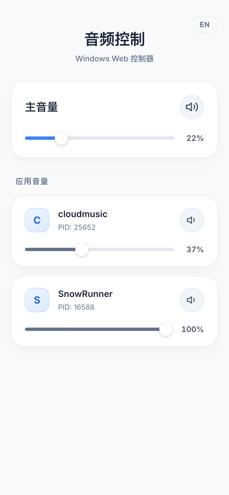

## 起因

玩游戏的时候要开音乐，但是有时候调试音量大小很麻烦，就用大模型vibe coding了这么小玩意，后续可能考虑加入控制音乐的上一首下一首，这样在遇到觉得不好听的歌也不用切屏直接就可以切歌
还有一个使用场景，就是躺床上了还想听听歌，但是音频的大小不合适，这时候就可以掏出手机直接控制音量大小，就不用跑来跑去调试了

## 运行效果

### PC端效果

### 手机端效果

## 仓库地址

https://github.com/crzliang/Windows_Audio_Controls
