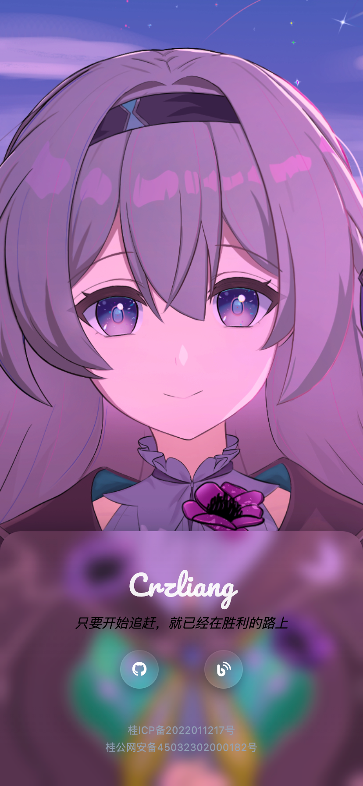

先放一下主页的链接：https://www.crzliang.cn/
仓库链接：https://github.com/crzliang/homepage
原先的个人主页长这样，当背景的人物居中时就会挡住人脸，所以就改了一个新的

新的长这样，改到了左侧，这样就不会挡住人脸了

移动端则是移到了下方显示，这样也不会挡住背景的人脸

以上的页面实现都是用GPT-5.4实现的，再次感谢奥特曼的free号🤪
