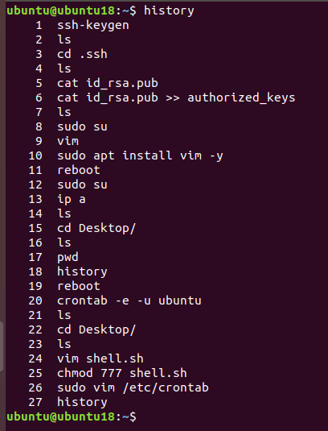
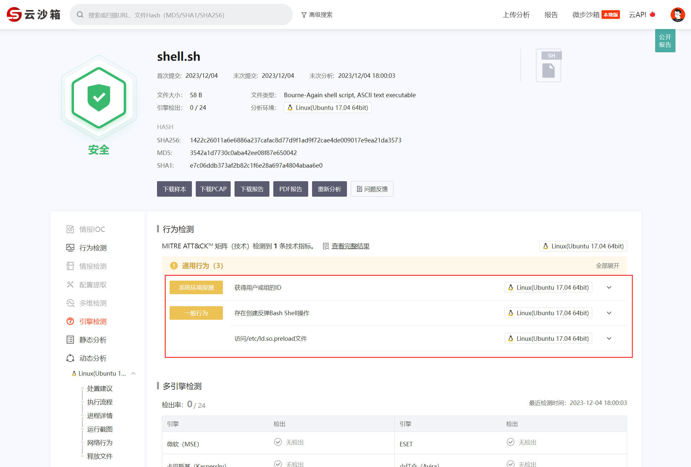
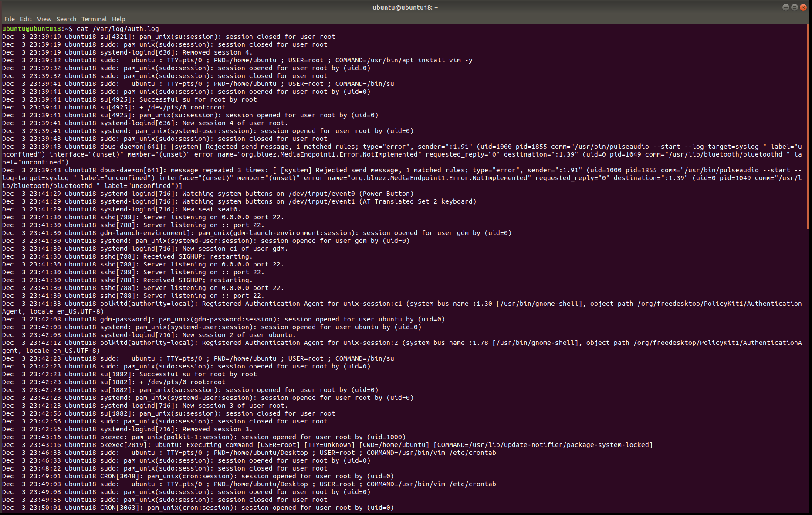
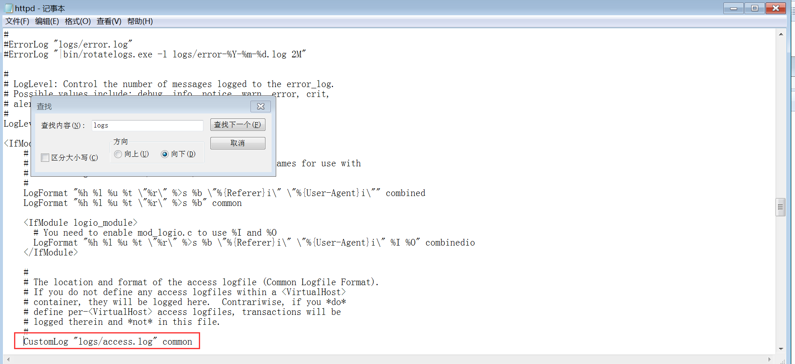
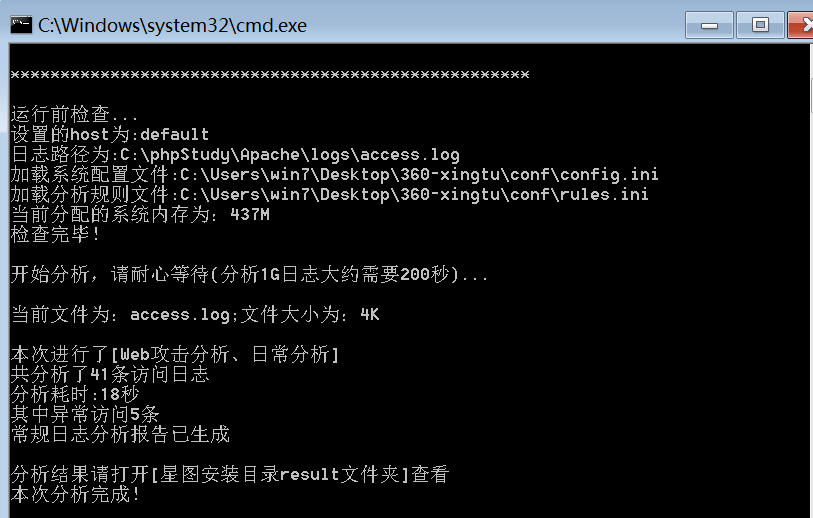
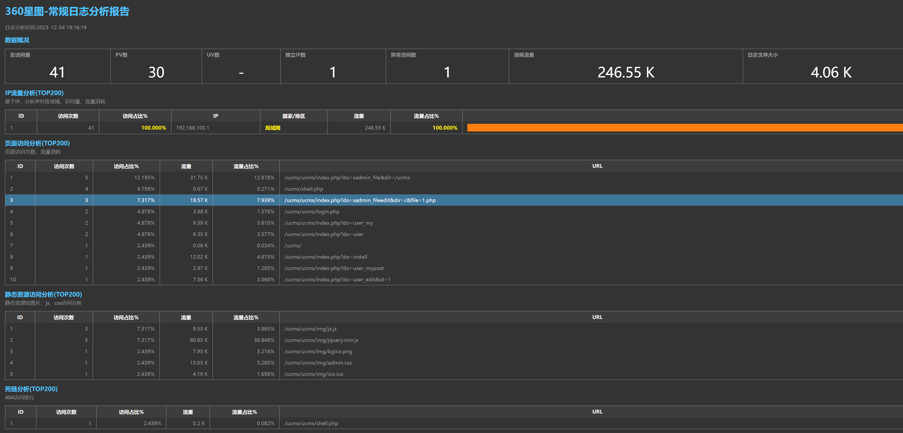
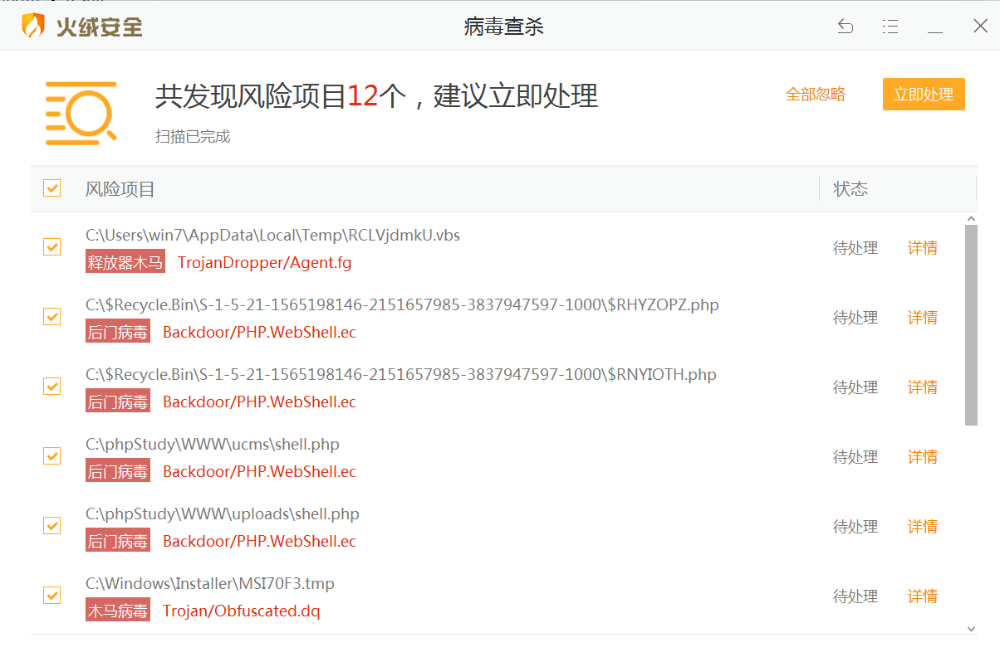
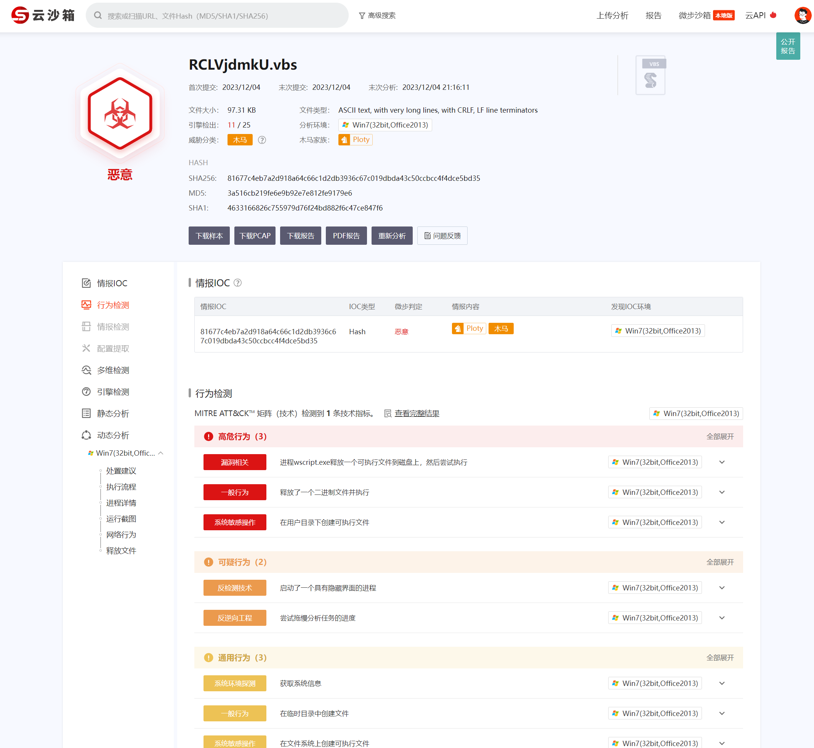

## 实验目的

1、学会对linux主机和windows主机进行入侵排查

## 实验任务

1、分析linux主机被入侵的原因和找出存在的后门

2、分析windows主机被入侵的原因和找出存在的后门

## 实验步骤

## Linux 入侵查杀

使用history可以看到历史运行命令，从第22到25条命令可以看到在桌面有一个shell.sh的文件

把文件提取出来，然后使用微步云在线沙箱进行查杀分析

检测出有反弹shell的行为

世界杀毒网并没有检测出来

然后排查ssh日志，我的机器上没有发现异常日志
Ubuntu的ssh日志是在记录在/var/log/auth.log里面的

## Windows 入侵查杀

> 下列是在Windows7的环境下使用phpstudy+ucms搭建一个简易的网站，利用CVE-2020-25483上传一句话木马，实验指导书是使用phpmyadmin的弱口令进入后台，通过修改日志目录实现了恶意文件的写入，从而被上马。

使用360星图分析access日志文件，日志文件在C:\phpStudy\Apache\logs目录下，此时的目录并没有access文件

需要修改C:\phpStudy\Apache\conf下的httpd.conf文件，去掉红框前的注释符号，然后重启服务即可

开启360星图，在运行前需要修改其配置文件，添加我们的日志地址

然后运行星图根目录下的start文件即可

然后在result目录下可以看到新建了三个文件，分别是安全分析报告、常规分析报告和漏洞攻击报告

在安全分析报告中可以成功识别出shell.php是远程代码执行漏洞

在常规日志分析中也可以看到是从shell.php攻击的

使用D盾进行扫描，同样可以扫描出来_

使用克隆账号检测可以检测出隐藏的账号（这里可执行添加，具体教程可百度)_

使用火绒可以扫出12项风险项目

我们提取第一项的vbs文件，利用微步云沙箱进行检测

使用世界杀毒网检测

可确定为恶意文件

结论：因为我使用的ucms的漏洞进行的攻击，所以修复建议是：升级到最新版本或后台关闭文件管理功能
