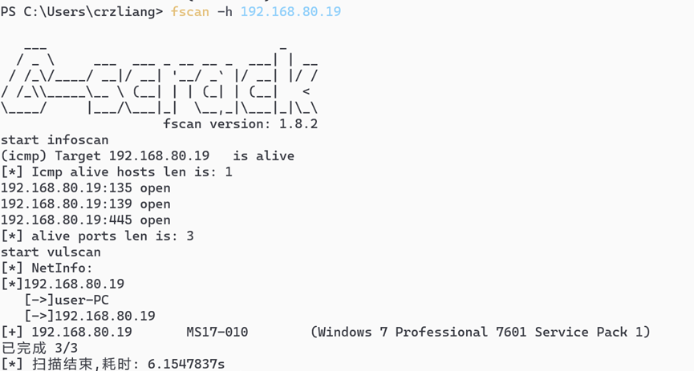
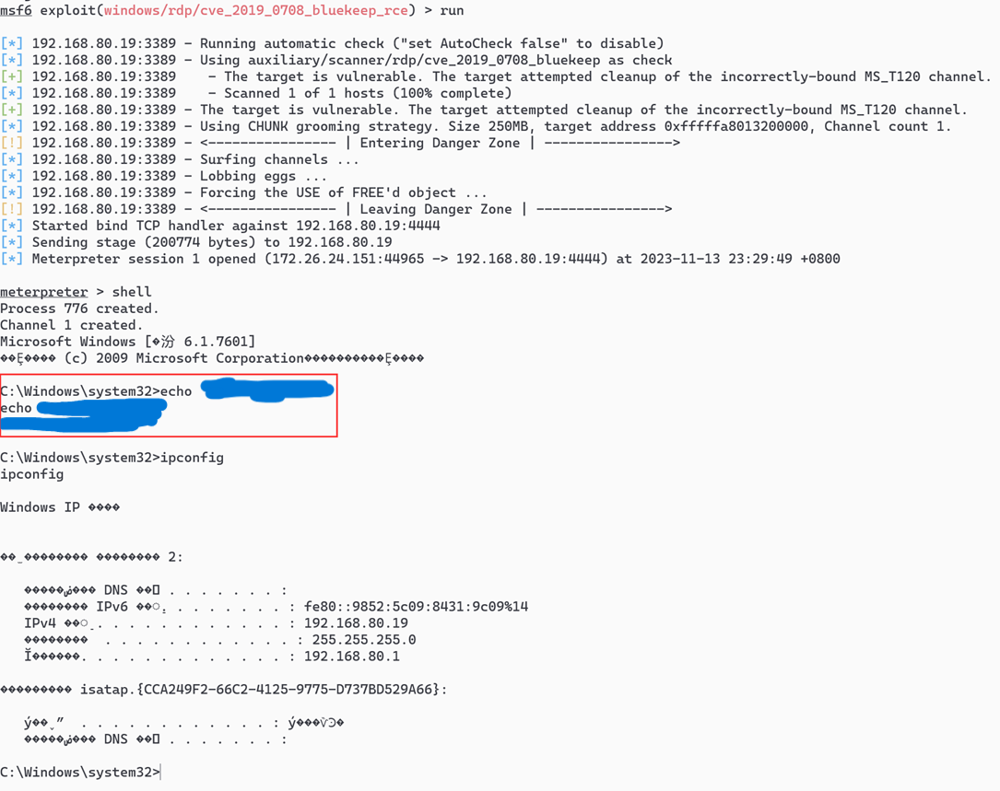
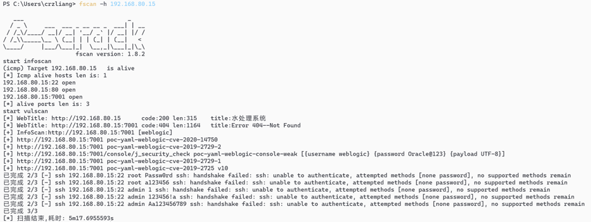

## 实验目的

1、熟悉主流的漏洞扫描工具比如goby,fscan,了解漏洞扫描工具的优点和弊端

## 实验任务

1、使用 goby,和fscan对不同类型的主机进行漏洞扫描,验证漏洞扫描工具扫描出的结果

## 实验步骤

1、 对192.168.80.19目标进行扫描

使用goby进行扫描，只扫出了MS17-010永恒之蓝漏洞，实验指导书上的CVE-2019-0708没有扫出来

同样的使用fscan也只扫出了MS17-010

 

直接使用msf，进行验证是否存在CVE-2019-0708，使用scanner/rdp/cve_2019_0708_bluekeep模块进行验证

但是无法利用成功

这是利用msf中的永恒之蓝的模块进行攻击，并成功rce

 

这是利用msf中的CVE-2019-0708针对Windows的远程桌面漏洞进行攻击，并成功rce

2、 对目标192.168.80.15进行漏洞扫描

使用fscan进行扫描，扫出了存在weblogic漏洞

但是goby扫不出来，很奇怪，有时可以有时不行

既然知道了存在weblogic漏洞，使用工具进行漏洞的利用

经过检测是可以利用的，而且还是root权限

命令执行成功

