# Burte Force（暴力破解）

## 概述

> “暴力破解”是一攻击具手段，在web攻击中，一般会使用这种手段对应用系统的认证信息进行获取。 其过程就是使用大量的认证信息在认证接口进行尝试登录，直到得到正确的结果。 为了提高效率，暴力破解一般会使用带有字典的工具来进行自动化操作。
>
> 理论上来说，大多数系统都是可以被暴力破解的，只要攻击者有足够强大的计算能力和时间，所以断定一个系统是否存在暴力破解漏洞，其条件也不是绝对的。 我们说一个web应用系统存在暴力破解漏洞，一般是指该web应用系统没有采用或者采用了比较弱的认证安全策略，导致其被暴力破解的“可能性”变的比较高。 这里的认证安全策略, 包括：
>
> 1.是否要求用户设置复杂的密码；
> 2.是否每次认证都使用安全的验证码（想想你买火车票时输的验证码～）或者手机otp；
> 3.是否对尝试登录的行为进行判断和限制（如：连续5次错误登录，进行账号锁定或IP地址锁定等）；
> 4.是否采用了双因素认证；
> ...等等。
> 千万不要小看暴力破解漏洞,往往这种简单粗暴的攻击方式带来的效果是超出预期的!
>
> 你可以通过“BurteForce”对应的测试栏目，来进一步的了解该漏洞。
>
> **从来没有哪个时代的黑客像今天一样热衷于猜解密码 ---奥斯特洛夫斯基**

## 基于表单的暴力破解


- 按题目的要求那就随便输入一个账号密码然后扔进burpsuite里直接爆破


- 首先把所有变量标记都删除了，然后只给账号密码的值加

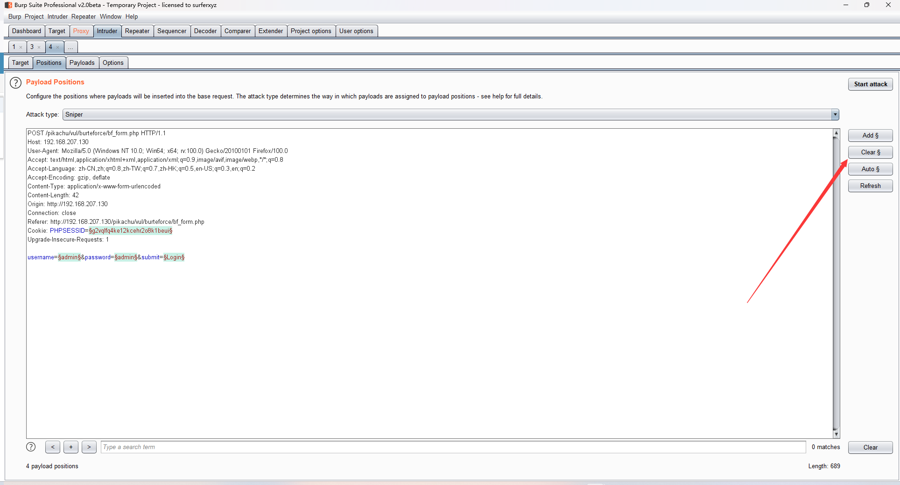

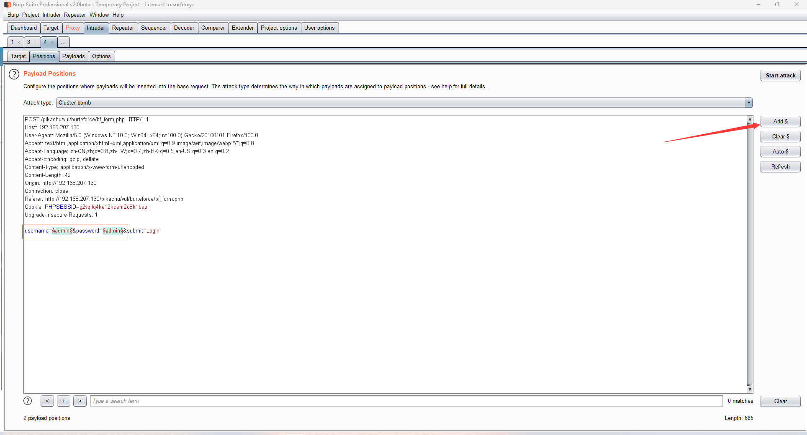

- 把攻击模式从sniper改成cluster bomb模式
- 然后在payloads里导入字典


- 根据回应的长度改变排序就可以看到有2组密码是能成功登录的。

## 验证码绕过（on server）

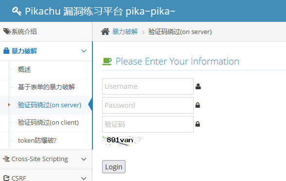

- 因为多了一个验证码肯定是不能按照上一题的方法直接开搞的，
- 看了一眼tips知道可以直接无视验证码直接开始爆破，那接下来的步骤和**基于表单的暴力破解**的一样

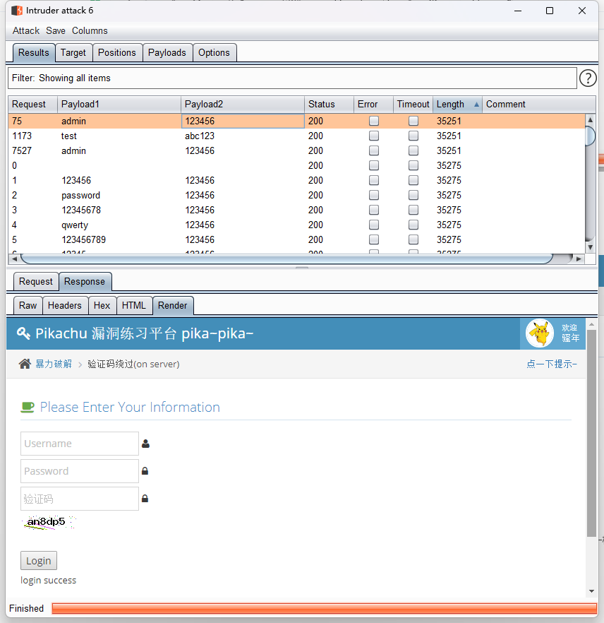

- 直接上结果

## 验证码绕过（on client）


- 这题虽然也有验证码，但是这次是不能忽视了，那就直接看tips


- 根据tips，F12查看前端JS

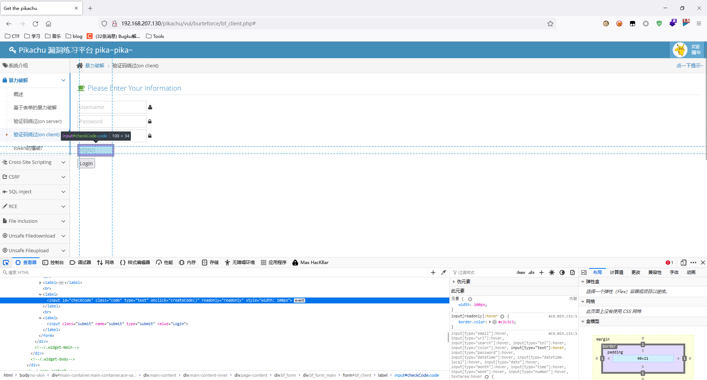

- 定位到了验证码的JS位置，我们尝试删除会不会有影响（既然不能选择无视它，那就让它直接消失）

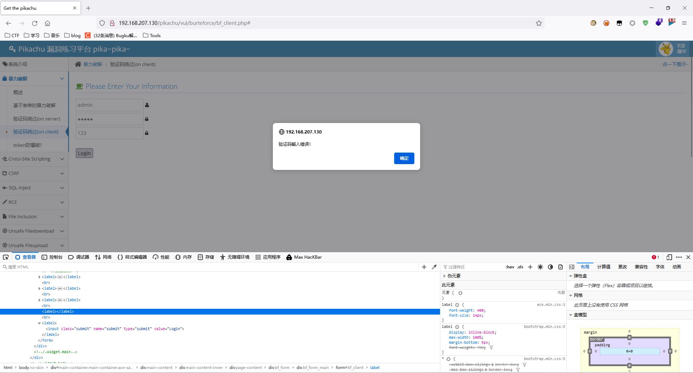

- 然而仅仅删除掉验证码那一块还不行，那我们就干脆连输入验证码的地方也删除了


- 都删完之后就会在尝试就会报错，然后验证码又重新出现，既然如此，我们就直接爆破

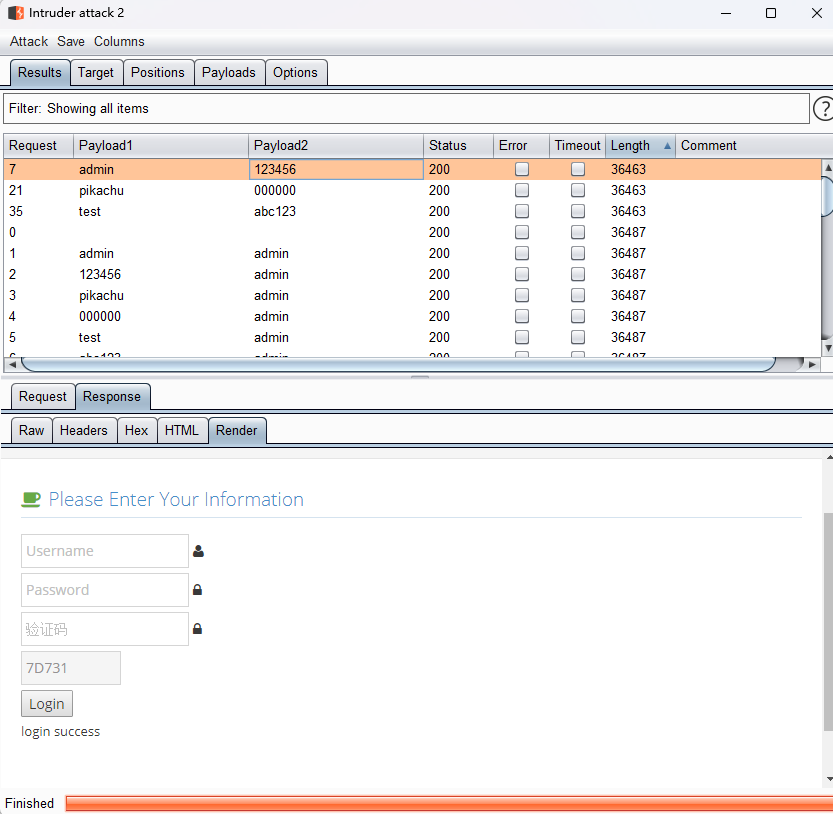

- 结果如图。

## token放爆破？

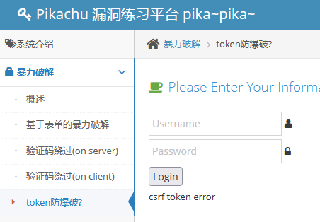

- 尝试直接爆破

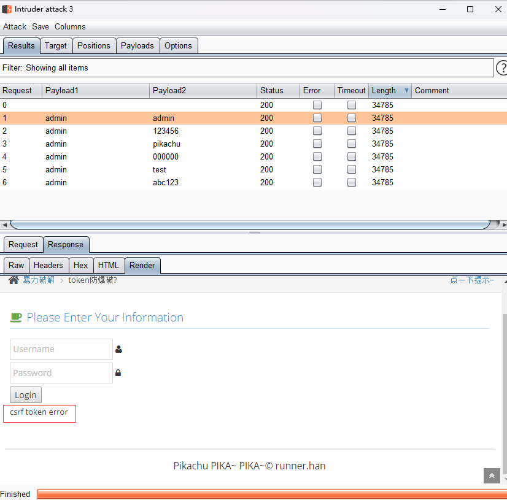

- 然而并不行，那就要想办法绕过token验证，看其他大佬的博客来操作
- 首先抓包放到爆破模块里按照前面的步骤操作
- 攻击的类型选择Pitchfork

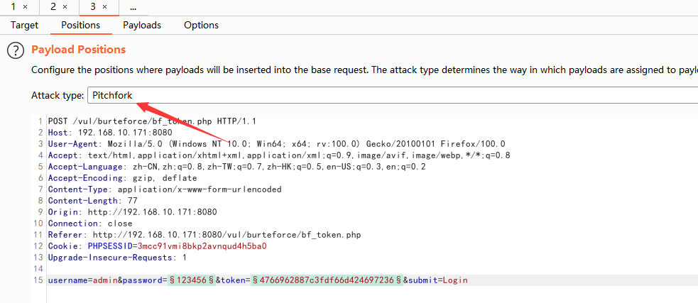

- 然后针对token要进行一些其他的处理
- 在Options中找到Grep-Extract把打上勾然后点击Add

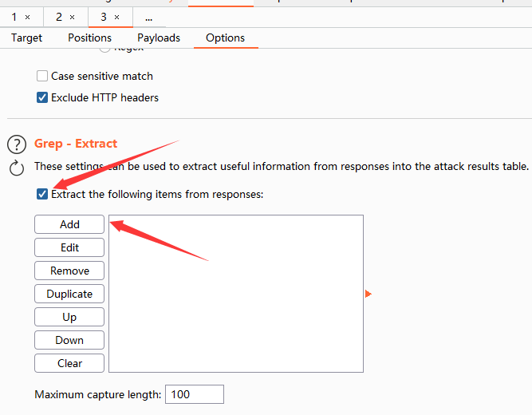

- 点击Add跳转到下图，然后点击Refetch response得到页面源码，通过搜索框去找到token的值，点击并复制，后面有用


- 在Intruder的Payloads中设置Payload set为1；type为Runtime file

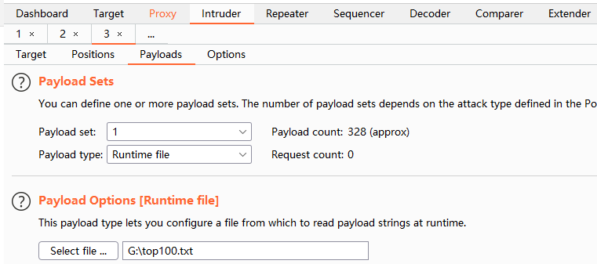

- set 为3；ytpe为Recursive grep；在Initial payload for first request中粘贴前面复制的token值

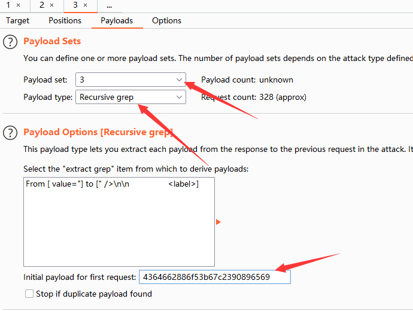

- 然后把线程改成1就可以开始爆破了

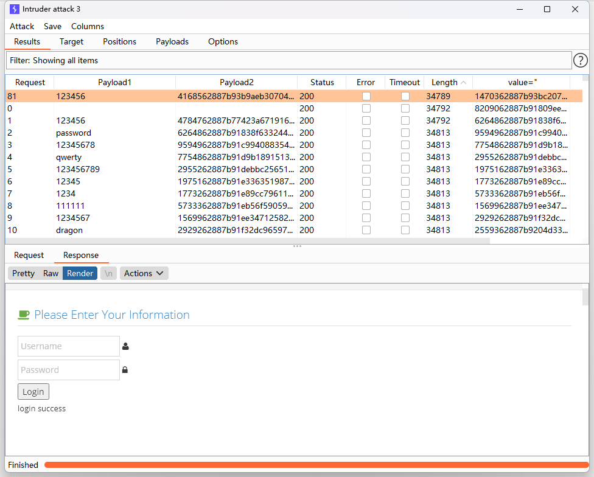

# Cross-Site Scripting（XSS 跨站脚本）

## 概述

> Cross-Site Scripting 简称为“CSS”，为避免与前端叠成样式表的缩写"CSS"冲突，故又称XSS。一般XSS可以分为如下几种常见类型：
> 1.反射性XSS;
> 2.存储型XSS;
> 3.DOM型XSS;
>
> XSS漏洞一直被评估为web漏洞中危害较大的漏洞，在OWASP TOP10的排名中一直属于前三的江湖地位。
> XSS是一种发生在前端浏览器端的漏洞，所以其危害的对象也是前端用户。
> 形成XSS漏洞的主要原因是程序对输入和输出没有做合适的处理，导致“精心构造”的字符输出在前端时被浏览器当作有效代码解析执行从而产生危害。
> 因此在XSS漏洞的防范上，一般会采用“对输入进行过滤”和“输出进行转义”的方式进行处理:
> 输入过滤：对输入进行过滤，不允许可能导致XSS攻击的字符输入;
> 输出转义：根据输出点的位置对输出到前端的内容进行适当转义;
>
> 你可以通过“Cross-Site Scripting”对应的测试栏目，来进一步的了解该漏洞。

## 反射型xss（get）

根据提示输入kobe


- 那我们直接在输入框输入payload

```js
<script>alert("xss")</script>
```

- 但是会发现输入框做了字数的限制

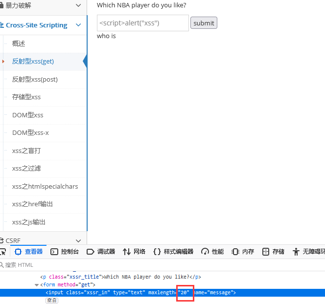

- 直接修改maxlength的值，然后在提交就发现成功了，同时我们也发现url后面有一串字符是和我们的payload很像的，经过查阅发现get类型的xss也可以通过url直接构造传参，但是post不可以


## 反射型xss（post）

- 直接传入payload


## 存储型xss

> 持久型XSS（Persistent）又叫做存储XSS（Stored XSS），与非持久型XSS相反，它是指通过提交恶意数据到存储器（比如数据库、文本文件等），Web应用程序输出的时候是从存储器中读出恶意数据输出到页面的一类跨站脚本漏洞（csrf 写 + self-xss = 存储 xss）。 存储型XSS，输出的位置不一定出现在输入的位置，很难依赖于扫描自动发现（请求后从此页面/refer开始爬，看是否能触发）。比如说客户端app输入的位置，可能在app 其他输出地方才会触发，或者需要分享到网页版才能触发。

- 直接在留言板输入payload并提交，提交后发现就算不输入任何的值也会弹窗

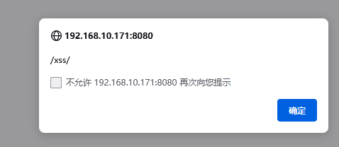

## DOM型xss

> DOM-Based XSS是一种基于文档对象模型(Document Object Model,DOM)的Web前端漏洞，简单来说就是JavaScript代码缺陷造成的漏洞。与普通XSS不同的是，DOM XSS是在浏览器的解析中改变页面DOM树，且恶意代码并不在返回页面源码中回显，这使我们无法通过特征匹配来检测DOM XSS，给自动化漏洞检测带来了挑战。

- 在输入框中随便输入一个值，然后在源码中找到


- 在源码中还发现了这一串代码

```js
<script>

                    function domxss(){

                        var str = document.getElementById("text").value;

                        document.getElementById("dom").innerHTML = "<a href='"+str+"'>what do you see?</a>";

                    }

                    //试试：'>

                    //试试：' onclick="alert('xss')">,闭合掉就行

                </script>
```

这一段JS，是告诉我们用户输入的字符串会被存到str然后拼接，

根据他提示的payload试试，攻击成功


## DOM型xss-x

- 这题乍一看和上一题很像
- 随便输入一个字符串然后提交后发现url变了
- 再点击连接，发现url又变了


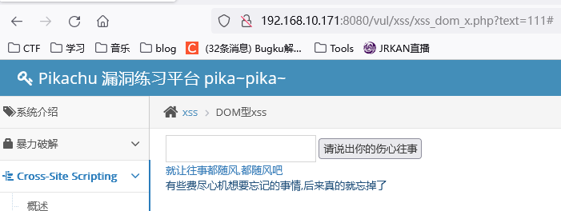

- 审查源码，发现和上一题类似

```js
<script>
                    function domxss(){

                        var str = window.location.search;

                        var txss = decodeURIComponent(str.split("text=")[1]);

                        var xss = txss.replace(/\+/g,' ');

//                        alert(xss);


                        document.getElementById("dom").innerHTML = "<a href='"+xss+"'>就让往事都随风,都随风吧</a>";

                    }

                    //试试：'>

                    //试试：' onclick="alert('xss')">,闭合掉就行

                </script>
```

- 直接构造payload：' onclick="alert('xss')">

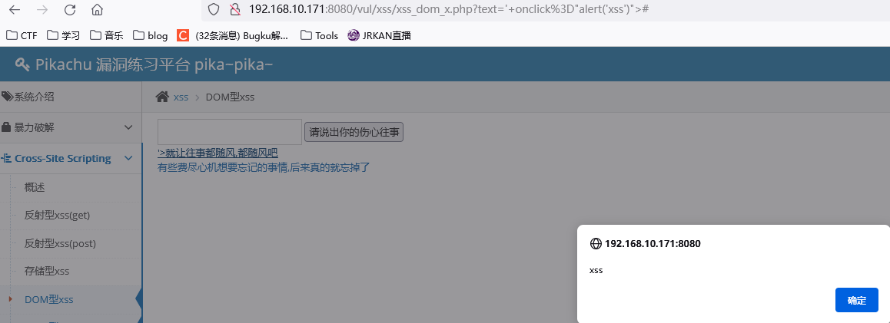

- 成功！

## xss之盲打
