## 前言

做这个两个靶机是因为在上的一个实践课的课设上面有一个题目就是有关应急响应的，提供的靶机就是知攻善防实验室其中的两个靶机

### 内容和要求

随着信息技术的飞速发展，网络安全问题日益凸显，企业面临的网络攻击和数据泄露风险不断增大。作为一名应急响应工程师，你深知应急响应在网络安全防护中的重要性。假如你在驻场值守的过程中发现攻击事件，你需要进行应急响应操作。具体要求如下：

1. 排查是否存在后门和账号情况；

2. 找到攻击路径；

3. 找到攻击者遗留的flag；

4. 在找出攻击路径的基础上尽可能的还原攻击过程；

5. 对发生的攻击的事件做出情况总结，如输出经验和教训，加固建议；

6. 根据找出的漏洞，或者挑一到两个你熟悉的漏洞写成技战法。

## Web2

### 排查是否存在后门和账号情况

打开计算机管理可以在本地用户和组可以看到有一个hack887$账号

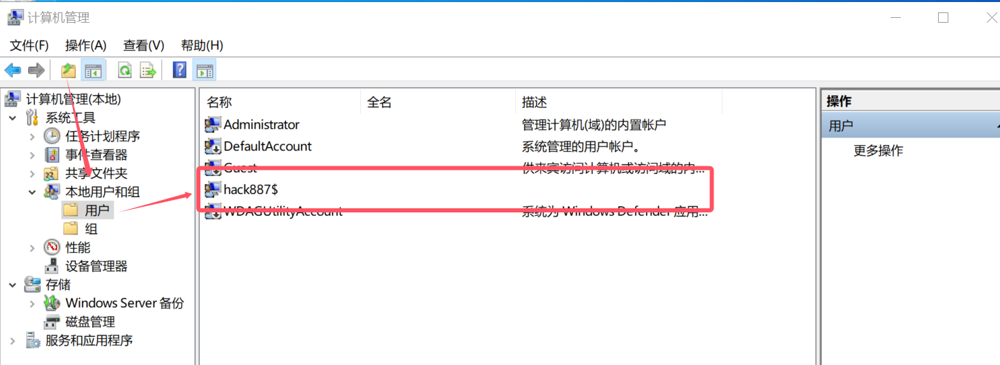

在渗透测试过程中，创建带有$结尾的账号，在 net user 时默认是不显示的，起到一定的隐藏作用

使用D盾扫描WWW目录可以看存在后门木马文件system.php

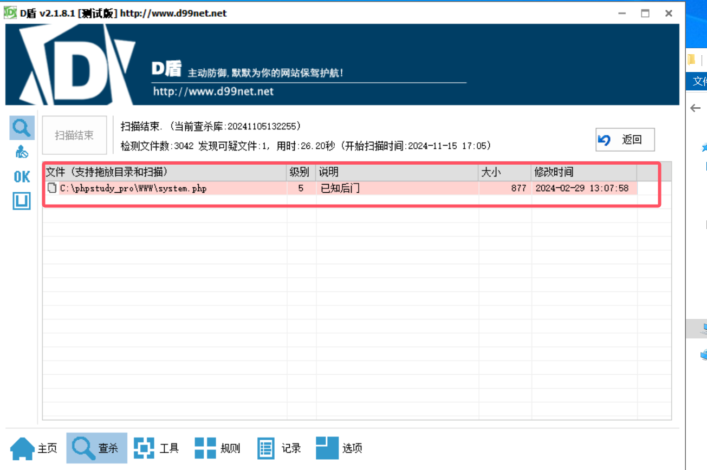

查看当中的内容可以看到连接密码是：hack6618

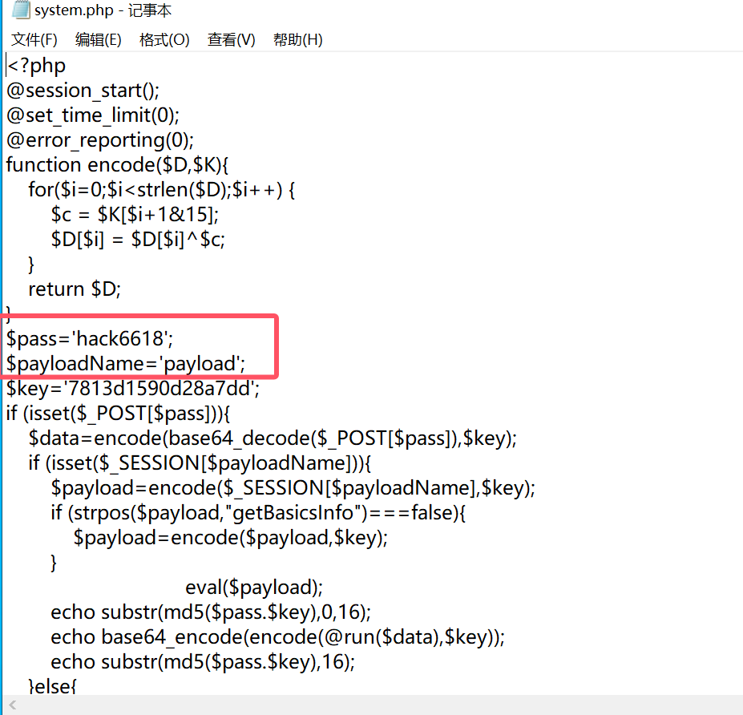

### 攻击路径

翻阅WWW目录下的所有log目录的文件，在FTP的log文件中可以看到IP：192.168.126.135上传了后门文件system.php

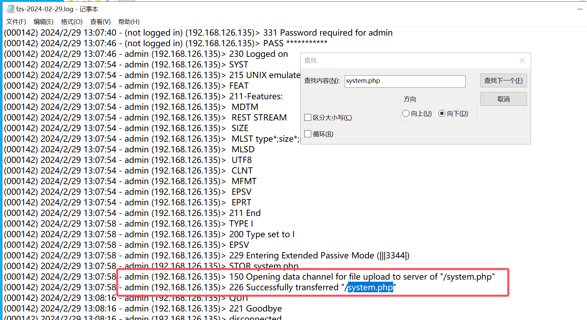

同时通过日志也可以看出黑客在短时间多次大量的尝试登录，就是想通过暴力破解的方式登录ftp，最后是成功爆破出了账号密码，登录ftp

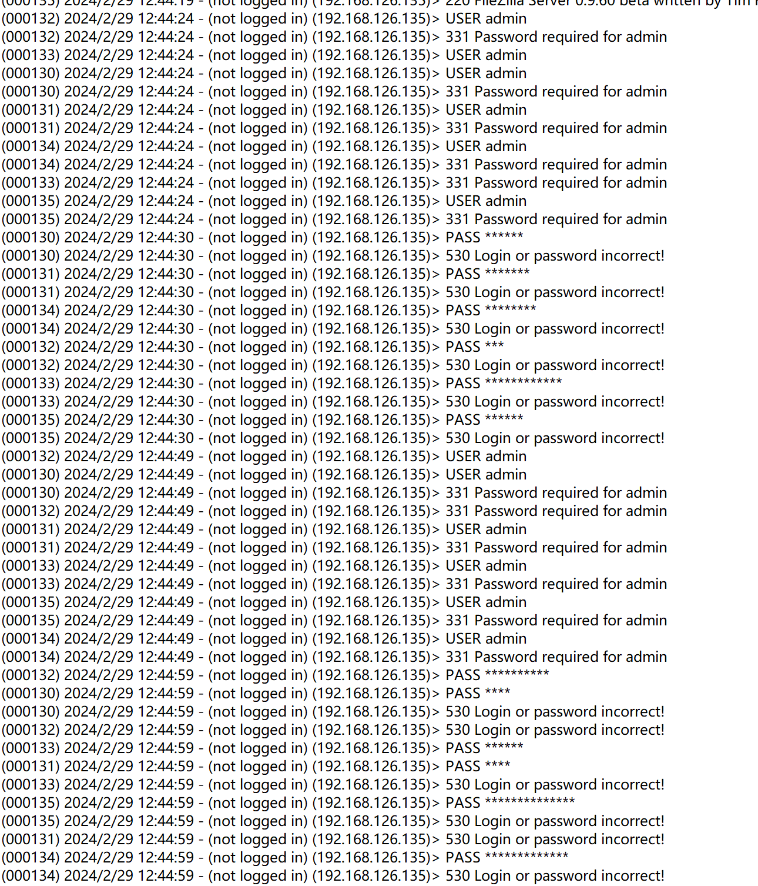

这是登录成功的日志

在apache的连接日志中也看都了192.168.126.135这个IP通过system.php这个文件进行连接的日志，所以可以确定这个就是一个后门文件

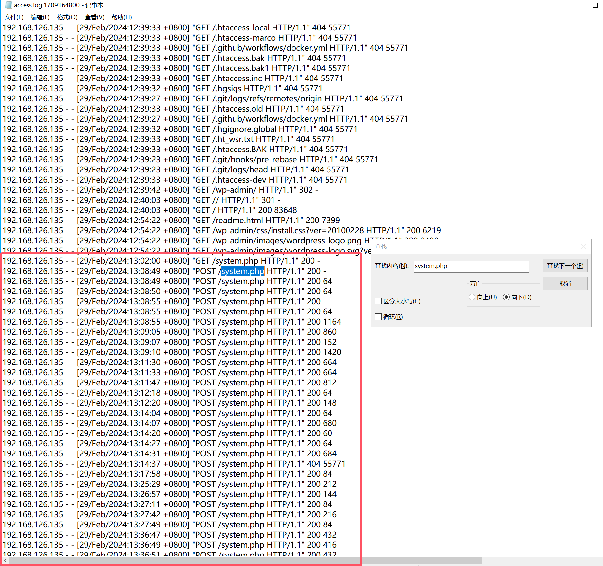

在WWW根目录下可以看到一个3389.bat的文件，这里面是利用**修改 Windows 注册表**以配置远程桌面（RDP）的相关设置，并将默认 RDP 端口更改为 **3389（0x0D3D 十六进制），**方便后续添加账号后使用rdp服务进行远程登录

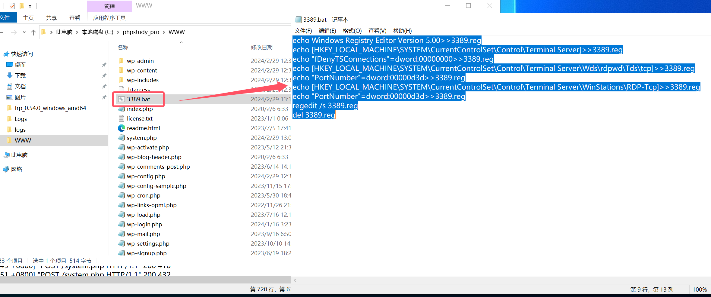

通过Windows的事件管理查看器可以看到黑客创建了一个hack887$的用户，并且该用户具有管理员权限

同样在Windows的事件查看器中**应用程序和服务日志的Microsoft-Windows-TerminalServices-RemoteConnectionManager/Operational**，也可以查询黑客使用rdp登录信息账号及IP

### 完整的攻击过程

由此可以得出黑客完整的攻击路径是：利用暴力破解FTP弱口令登录FTP服务-->上传system.php后门文件（webshell）到网站根目录-->利用webshell控制主机后添加有管理权限的hack887$用户，并上传了开启3389的bat文件-->利用rdp服务登录主机，实现完全控制主机

### 加固建议

#### 加固用户名密码

不使用常见的用户名如：admin、root等，也不要使用与公司或者业务相关的关键词来当作用户名

密码建议使用更为复杂的组合方式，如：大小写+特殊字符+数字的形式，并且至少是12位数及以上，而且密码中不包含常用密码类型，以及用户名的出现

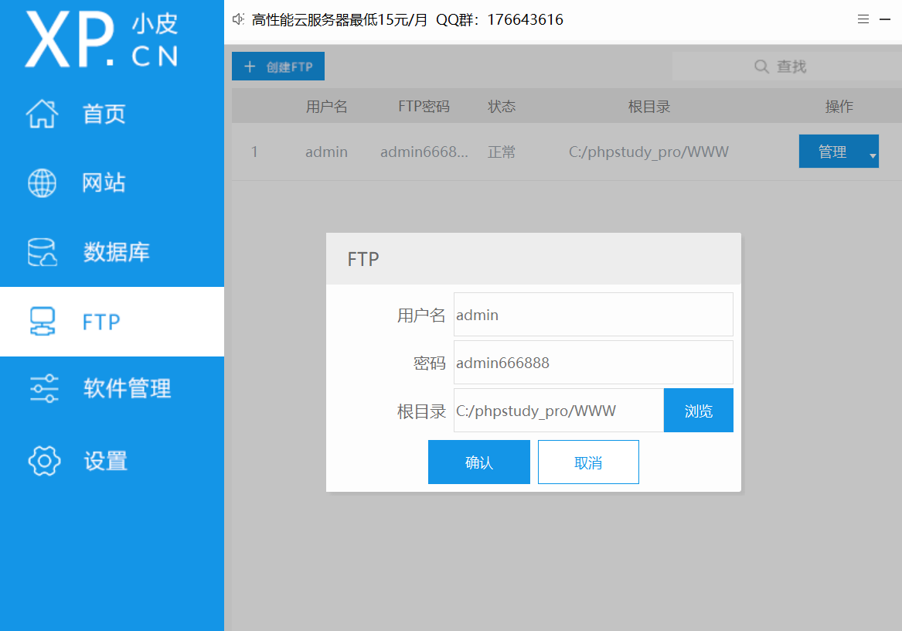

#### 系统加固

在该机器上并没有运行杀毒软件，在设置中可以看到最基本的Windows Defender都没有开启，这无疑是降低了黑客入侵的难度

我的防护建议是开启Windows Defender，条件允许的情况下安装360、火绒或者卡巴斯基等杀毒软件，提高系统防护

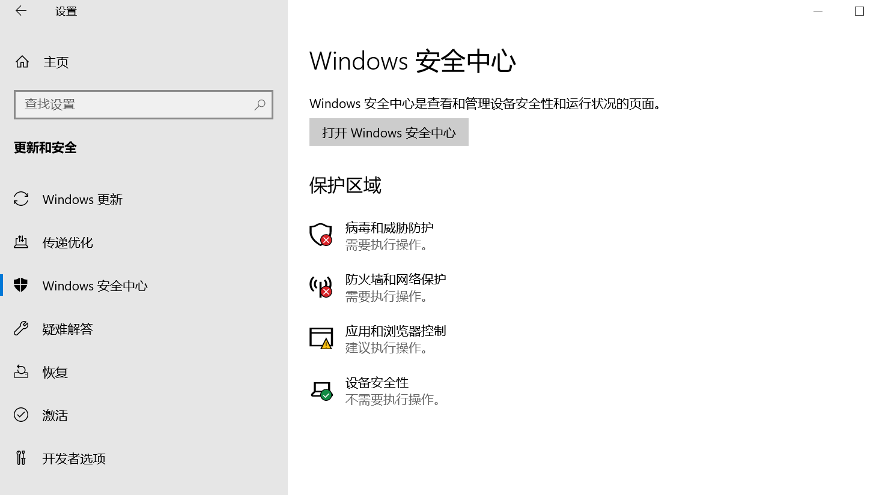

通过要及时的更新补丁，不给攻击者留有攻击的可能，

下图是查看到的当前系统已有的补丁，以及等待安装的补丁，应及时的进行更新补丁以及各类驱动

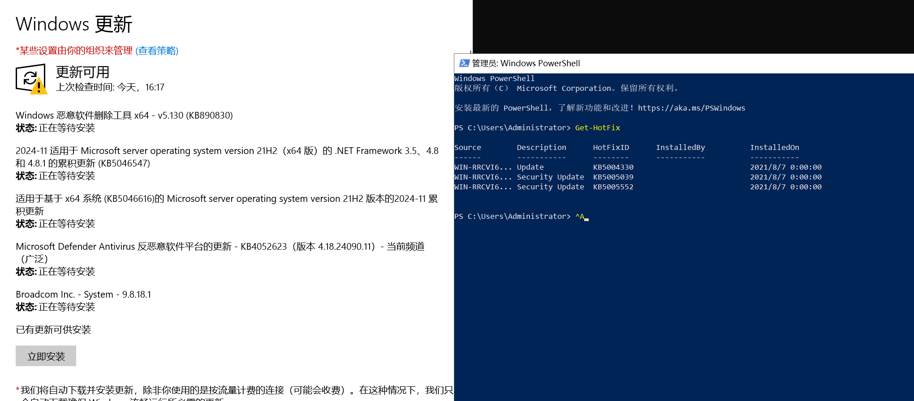

### 解题系统答案

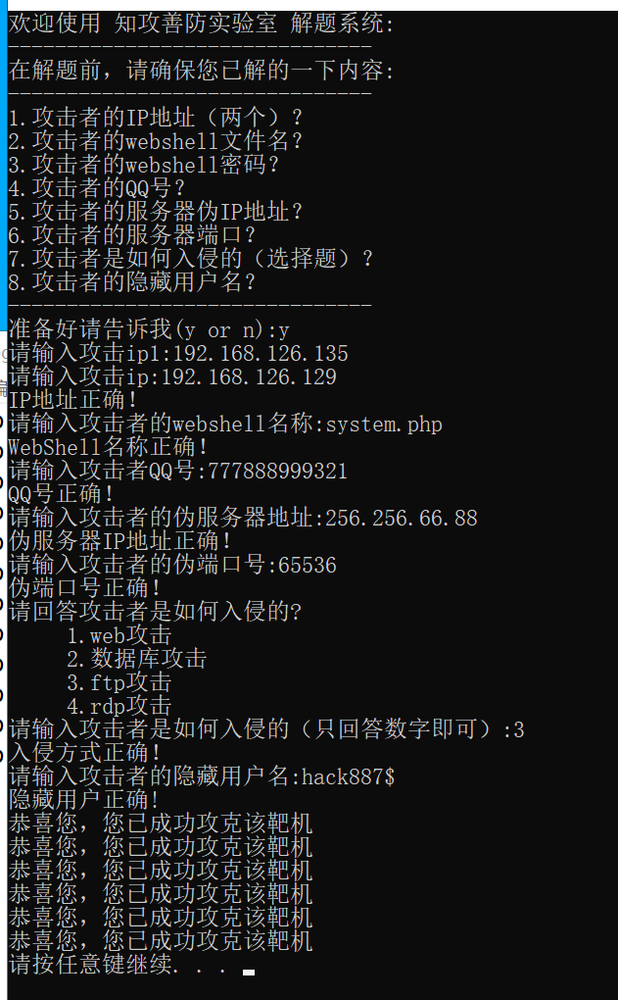

## Linux 1

### 找到攻击者遗留的flag

使用history命令查看使用过的命令，可以看到有flag，以及有对/etc/rc.d/rc.local进行了改动

找到第二个flag

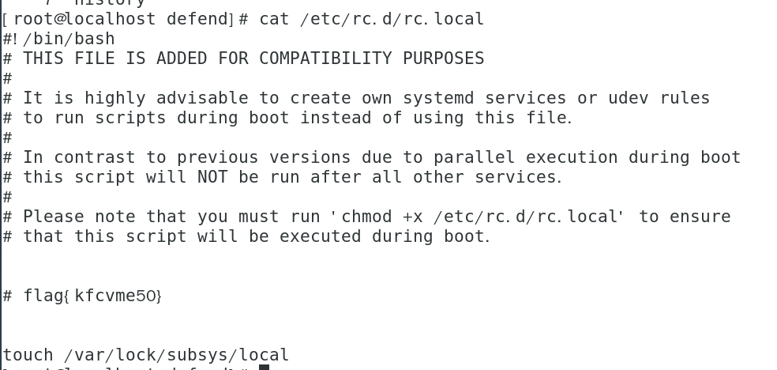

查看/etc/passwd的内容，可以看到存在redis用户，说明这台机器是提供redis服务的

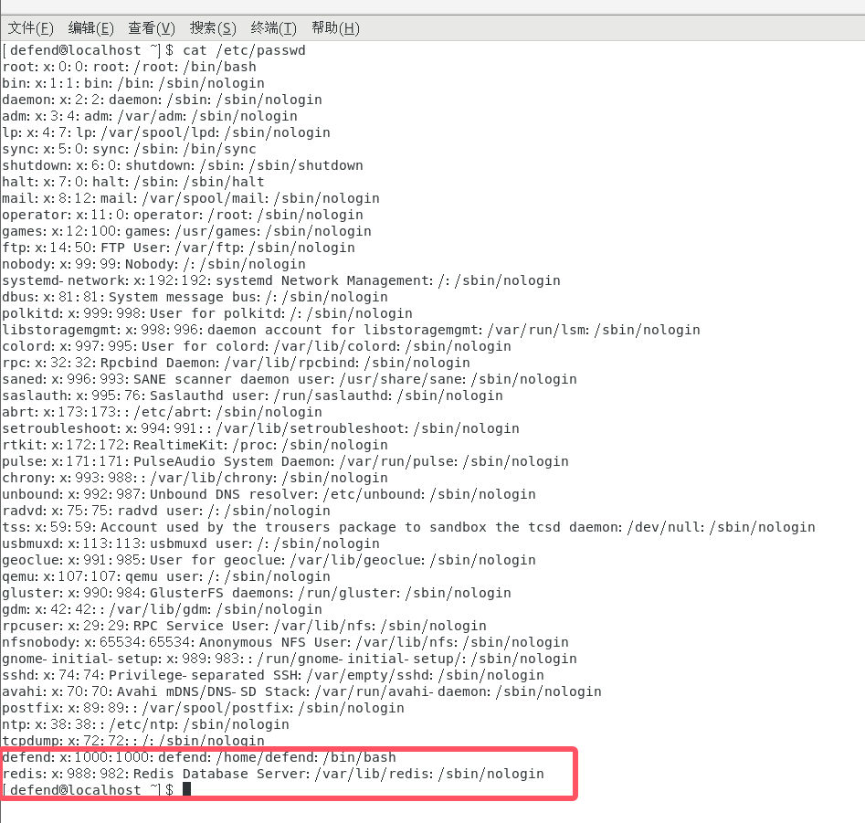

推测黑客通过redis进行的攻击

在/etc/redis.conf文件中，可以看到设置密码的参数是被注释了，及满足未授权的要求

同时在该文件中找到了第三个flag

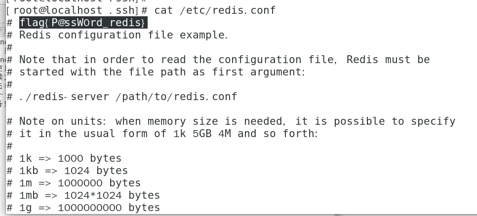

### redis未授权攻击的三种方法

> 1. 写ssh密钥进行连接
> 2. 上传webshell进行连接
> 3. 写定时任务

进入到定时任务保存目录/var/spool/cron目录下并没有定时任务，所以排除

在/etc/passwd中也没有出现www或www-data用户，也可以排除该机器存在可执行webshell的环境

在root用户的.ssh的authorized_keys文件中发现了利用redis进行写ssh密钥的痕迹，且看到了攻击机是一台kali

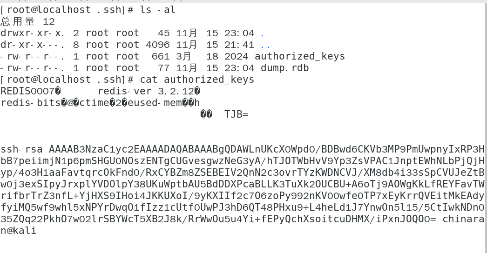

### 攻击者IP

那么通过查看ssh登录日志即可获取到攻击者的IP

### 攻击路径&攻击过程

黑客利用redis未授权写入ssh密钥-->ssh密钥登陆主机，实现控制主机

且redis是使用root权限启动，因此黑客才可以把密钥写入root/.ssh目录的authorized_keys文件中，因此这直接可以让黑客省去了提权的步骤

### 加固建议

redis服务的默认配置文件是无密码的，因此生产环境中应当正确配置redis的配置文件，使用强密码进行连接；更改默认用户名和默认端口，这样可以起到一定的防御作用

redis服务应该使用较低权限的用户进行启动，这样即使黑客攻击成功了，获取到的权限也相对较低，只要服务器无常见的提权漏洞存在，基本上可以遏制黑客的部分行为

### 题解答案

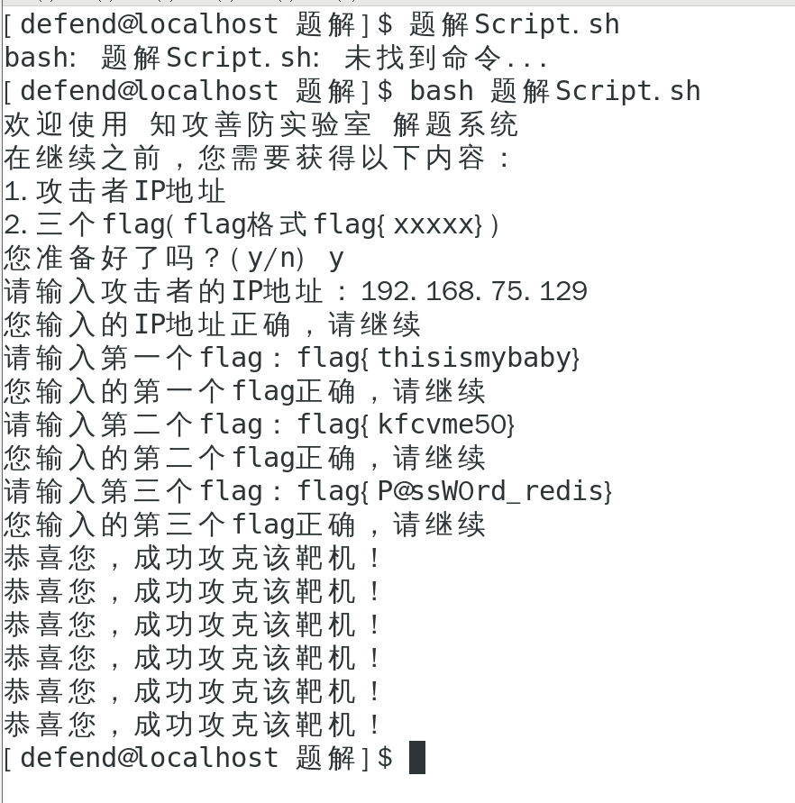

## 技战法

> 这部分写得比较水，就不展示了
